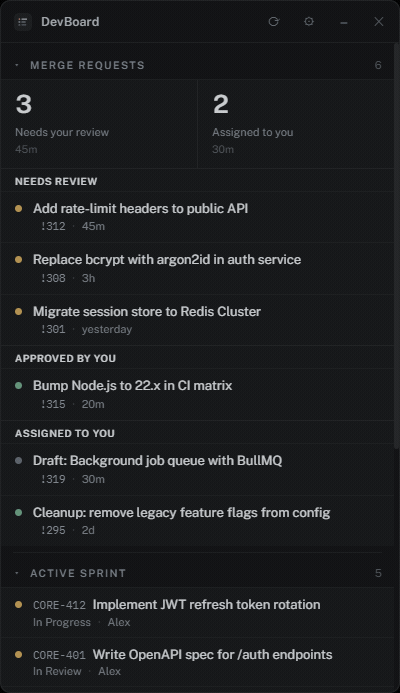
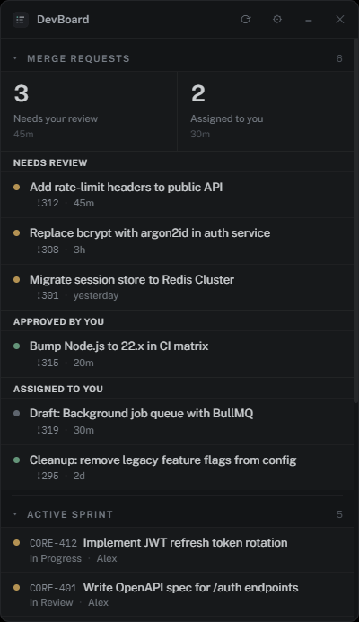

# DevBoard

A frameless, always-on-top desktop widget for Windows and Linux that surfaces your GitLab merge requests and Jira issues in a single panel.

 





## Features

- **GitLab MRs** grouped by state — Needs review, Changes requested, Approved, Assigned to you
- **Jira panels** — Active sprint, Backlog, or any custom JQL query
- Collapsible panels, drag-to-reorder, add/remove panels from settings
- Three accent themes: Teal, Slate Blue, Clay
- Adjustable opacity and always-on-top toggle
- Credentials stored in the OS keychain (Windows Credential Manager / libsecret) — never written to disk

## Requirements

- Node.js 18+
- On Linux: `libsecret-1-dev` for keychain support (`sudo apt install libsecret-1-dev`)

## Setup

```bash
npm install
```

### GitLab
Generate a personal access token at **User Settings → Access Tokens** with the `read_api` scope.

### Jira
Generate an API token at [id.atlassian.com/manage-api-tokens](https://id.atlassian.com/manage-api-tokens). Use your Atlassian account email alongside it.

## Running

```bash
npm start
```

Enter your credentials in the Settings drawer (⚙ icon) on first launch.

## Building

```bash
npm run build:win    # Windows NSIS installer
npm run build:linux  # Linux AppImage
```

Output lands in `dist/`.
